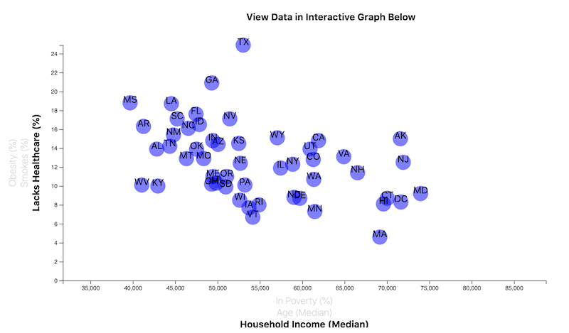
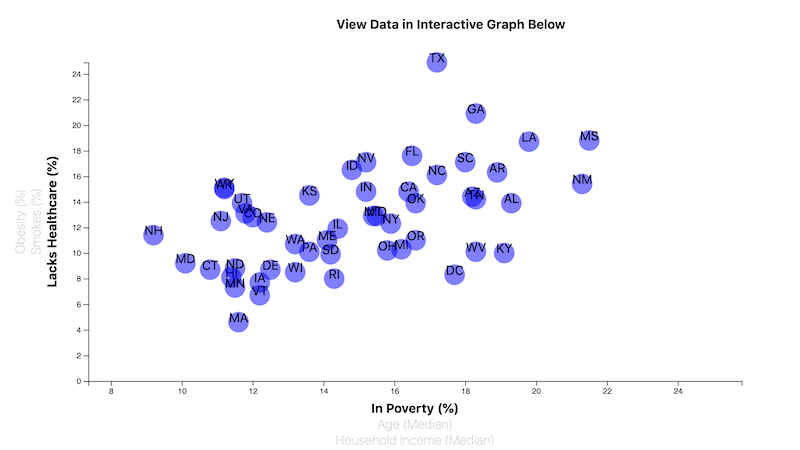
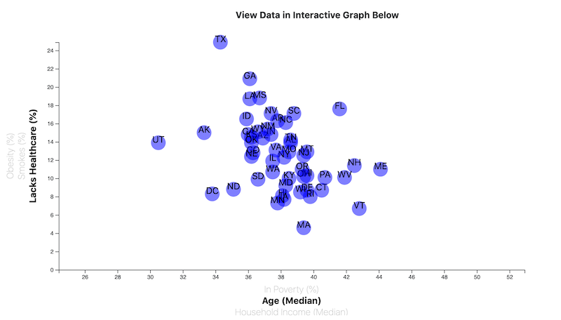
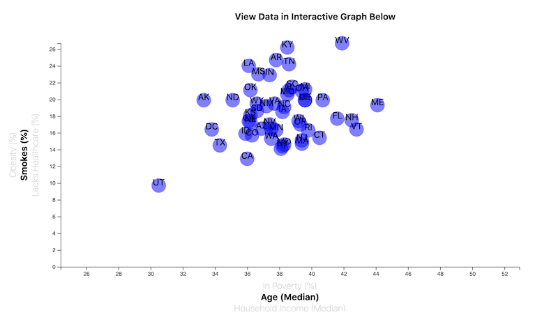
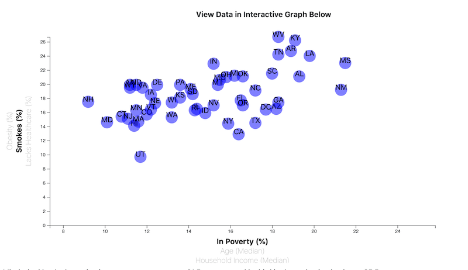

# Interactive JavaScript Visualization
I wrote JavaScript code to create an interactive visualization of health factors by state in the United States. The x-axis allows the user to choose Median Household Income, Median Age, and Percent in Poverty, and the y-axis allows the user to choose Percent Obesity, Percent Smokers, and Percent Lacking Healthcare. Based on those choices, the graphic displays a variable scale for each choice combination and plots each data point.

# Sample Images

